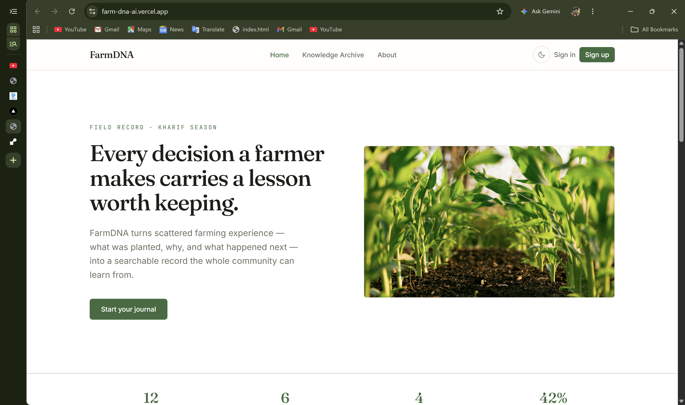

# FarmDNA

AI-powered agricultural knowledge preservation platform that helps farmers record their farming decisions, track outcomes, and receive AI-generated insights from their own recorded experience.

## Live Demo

**App:** https://farm-dna-ai.vercel.app
**API docs (Swagger):** https://farmdna-backend.onrender.com/docs

> Note: the backend is hosted on Render's free tier, which spins down after ~15 minutes of inactivity. The first request after an idle period can take 30–60 seconds to respond while the server wakes up.


## Screenshots

<!--
  Save 3–4 screenshots into a folder like docs/screenshots/ in the repo,
  then replace the paths below with the real filenames. Suggested shots:
  Home page, Dashboard with AI Insights generated, Decision Journal with
  entries, and either Login or the mobile responsive view.
-->

| Home | Dashboard + AI Insights |
|---|---|
|  |  |

| Decision Journal | Mobile view |
|---|---|
|  |  |

## Features

- **Decision Journal** — record farming decisions (crop, region, season, decision, reasoning) and update them later with harvest outcomes
- **Outcome Tracking** — log yield results and mark each decision as successful, partial, or a failure
- **AI Pattern Discovery** — Google Gemini analyzes a farmer's own recorded entries and returns structured patterns plus one actionable recommendation, with an optional free-text question to focus the analysis
- **Knowledge Archive** — public, searchable view of all community-submitted entries when logged out; a private view scoped to only the logged-in user's own entries when logged in
- **Authentication** — email/password registration with bcrypt password hashing, JWT-based sessions, and one-click Google OAuth sign-in
- **Dashboard** — at-a-glance stats (total entries, entries this season, successful entries) plus on-demand AI insights
- **Dark / light mode** — theme preference persists across sessions
- **Responsive design** — tested at mobile (375px), tablet (768px), and desktop (1440px) breakpoints, including a mobile hamburger navigation menu
- **Error handling throughout** — loading states, toast notifications on failure, a React error boundary to prevent blank-screen crashes, and a delete-confirmation dialog before destructive actions

## Tech Stack

| Layer | Technology |
|---|---|
| Frontend | React 19, Vite, Tailwind CSS v4, React Router |
| Backend | Python, FastAPI, Uvicorn |
| Database | MongoDB Atlas (via the Motor async driver) |
| Authentication | JWT (`python-jose`), bcrypt (`passlib`), Google OAuth 2.0 (`Authlib`) |
| AI | Google Gemini (`gemini-3.1-flash-lite`, via the `google-genai` SDK) |
| Rate limiting | `slowapi` |
| Frontend hosting | Vercel |
| Backend hosting | Render |

## Setup Instructions

### Prerequisites
- Node.js 20.19+ or 22.12+
- Python 3.10 or 3.11 (not 3.14 — see Known Limitations)
- A MongoDB Atlas account (free M0 tier is sufficient)
- A Google Gemini API key ([aistudio.google.com](https://aistudio.google.com))
- Google OAuth credentials ([Google Cloud Console](https://console.cloud.google.com)) — optional, only needed for the "Continue with Google" login option

### 1. Clone the repository
```bash
git clone https://github.com/AnubhavPurohit07/FarmDNA-ai.git
cd FarmDNA-ai
```

### 2. Backend setup
```bash
cd backend
python -m venv venv
source venv/Scripts/activate      # Windows Git Bash
# source venv/bin/activate        # macOS/Linux
# venv\Scripts\Activate.ps1       # Windows PowerShell

pip install -r requirements.txt
cp .env.example .env
```

Open `.env` and fill in real values:
```
MONGO_URI=mongodb+srv://<username>:<password>@your-cluster.mongodb.net/?retryWrites=true&w=majority
DB_NAME=farmdna
JWT_SECRET=<generate with: python -c "import secrets; print(secrets.token_hex(32))">
GOOGLE_CLIENT_ID=<from Google Cloud Console>
GOOGLE_CLIENT_SECRET=<from Google Cloud Console>
GOOGLE_REDIRECT_URI=http://localhost:8000/api/auth/google/callback
FRONTEND_URL=http://localhost:5173
GEMINI_API_KEY=<from aistudio.google.com>
```

Start the backend:
```bash
uvicorn app.main:app --reload --port 8000
```
API docs available at `http://localhost:8000/docs`.

### 3. Frontend setup
```bash
cd ../frontend
npm install
```

Create `frontend/.env` (optional for local dev — falls back to the deployed backend if omitted):
```
VITE_API_URL=http://localhost:8000
```

Start the frontend:
```bash
npm run dev
```
App available at `http://localhost:5173`.

## API Documentation

Full interactive documentation is auto-generated by FastAPI at `/docs`. Summary of the main endpoints:

| Method | Endpoint | Auth required | Description |
|---|---|---|---|
| POST | `/api/auth/register` | No | Register a new user. Returns a JWT. |
| POST | `/api/auth/login` | No | Log in with email/password. Returns a JWT. |
| GET | `/api/auth/google` | No | Redirects to Google's OAuth consent screen. |
| GET | `/api/auth/me` | Yes | Returns the current logged-in user's profile. |
| GET | `/api/entries/public` | No | List all community entries. |
| GET | `/api/entries` | Yes | List only the logged-in user's entries. |
| POST | `/api/entries` | Yes | Create a new entry. |
| PUT | `/api/entries/{id}` | Yes | Update an entry (owner only). |
| DELETE | `/api/entries/{id}` | Yes | Delete an entry (owner only). |
| POST | `/api/ai/insights` | Yes | Analyze the user's entries with Gemini; returns patterns + a recommendation. |

**Example — `POST /api/auth/login`**

Request:
```json
{
  "email": "farmer@example.com",
  "password": "yourpassword"
}
```

Response `200 OK`:
```json
{
  "access_token": "eyJhbGciOiJIUzI1NiIs...",
  "token_type": "bearer",
  "user": {
    "_id": "6748abc123def456789012",
    "name": "Anubhav Purohit",
    "email": "farmer@example.com",
    "region": "Uttarakhand",
    "created_at": "2026-07-09T10:00:00Z"
  }
}
```

**Example — `POST /api/ai/insights`**

Request (focus question optional):
```json
{ "focus_question": "How is my wheat performing?" }
```

Response `200 OK`:
```json
{
  "patterns": [
    "Both recorded wheat entries used weather-responsive irrigation timing and were marked successful."
  ],
  "recommendation": "Continue adjusting irrigation timing based on seasonal forecasts rather than a fixed schedule.",
  "entries_analyzed": 3
}
```

## Architecture / Folder Structure

```
FarmDNA/
├── frontend/
│   └── src/
│       ├── api/            # Fetch-based API client functions (entries.js, ai.js)
│       ├── components/     # Navbar, Footer, ErrorBoundary, ProtectedRoute, ui/ (Button, Input, Modal, Toast, Loader)
│       ├── context/         # AuthContext (JWT + user state), ThemeContext (dark/light mode)
│       └── pages/           # Home, Dashboard, Journal, Archive, About, Login, Register, AuthCallback
├── backend/
│   └── app/
│       ├── auth/            # JWT creation and verification
│       ├── db/               # MongoDB (Motor) connection
│       ├── middleware/       # require_auth dependency for protected routes
│       ├── models/           # Pydantic models (Entry, User)
│       ├── routes/           # auth.py, entries.py, ai.py — all API endpoints
│       ├── services/          # ai_insights.py — Gemini prompt construction and API calls
│       └── main.py            # FastAPI app setup, CORS, rate limiting, router registration
├── PROMPTS.md                 # AI prompt iteration log for the Gemini integration
└── README.md                   # This file
```

The backend follows a route → service → database pattern: routes handle HTTP concerns and auth checks, services contain business logic (like Gemini prompt construction in `ai_insights.py`), and MongoDB access is centralized in `db/connection.py`.

## Known Limitations

- **Render free tier cold start** — see the note under Live Demo above.
- **MongoDB Atlas M0 (free) cluster** — capped at 512 MB storage; sufficient for this project's current scale.
- **Gemini API free tier rate limits** — rapid repeated requests to the AI Insights feature can occasionally return a rate-limit error; this is surfaced to the user clearly rather than failing silently.
- **Google OAuth in Testing mode** — the OAuth consent screen is not yet published, so only email addresses added as test users in Google Cloud Console can complete Google sign-in. Email/password registration is unaffected and works for any user.
- **AI insights use only the logged-in user's own entries** — the feature does not yet draw on the full community Knowledge Archive when generating insights; expanding this to a retrieval-based (RAG) approach over the shared archive is a planned next step.
- **No password reset flow yet** — users who forget their password currently cannot self-recover access via email; this would be a priority addition for a real production release.

## Credits & Acknowledgements

- Built as part of a 9-week AI Assigned Full Stack Internship (Agri-Allied sector).
- **Anthropic's Claude** was used extensively throughout development as an AI pair-programming assistant — for scaffolding components, debugging deployment issues (CORS, SSL/TLS, MongoDB IP whitelisting, Gemini model deprecations), and reviewing code structure. All architectural decisions, testing, and final implementation choices were made and verified by the developer.
- UI design references: [Fraunces](https://fonts.google.com/specimen/Fraunces) and [Inter](https://fonts.google.com/specimen/Inter) type families via Google Fonts.
- Stock imagery sourced from [Unsplash](https://unsplash.com) during early development.
- Official documentation referenced: [FastAPI](https://fastapi.tiangolo.com), [React](https://react.dev), [MongoDB Atlas](https://www.mongodb.com/docs/atlas/), [Google Gemini API](https://ai.google.dev).
